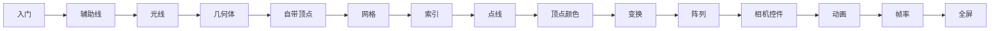

# 入门案例

Three.js 入门系列共 **15 篇**，建议按顺序阅读。每篇包含：效果说明、核心概念、实现步骤、代码要点与完整源码。

> 本分类案例均已对照 [three-cesium-examples](https://github.com/z2586300277/three-cesium-examples/tree/dev) 源码生成精讲文档。

[▶ 案例编辑器](https://z2586300277.github.io/three-cesium-examples/#/example) · [← 返回总目录](/examples/)

## 学习路线

| 序号 | 案例 | 核心知识点 |
|:---:|------|-----------|
| 1 | [入门](/examples/three/introduction/入门) | Scene / Camera / Renderer，Mesh = Geometry + Material |
| 2 | [辅助线](/examples/three/introduction/辅助线) | AxesHelper 坐标系，右手坐标系 X/Y/Z |
| 3 | [光线](/examples/three/introduction/光线) | 光源类型、材质与光照的关系 |
| 4 | [几何体](/examples/three/introduction/几何体) | Box / Sphere / Cylinder 等内置几何体 |
| 5 | [自带几何体顶点](/examples/three/introduction/自带几何体顶点) | attributes.position，细分参数 |
| 6 | [网格](/examples/three/introduction/网格) | BufferGeometry 手写三角形 |
| 7 | [索引](/examples/three/introduction/索引) | geometry.index 顶点复用 |
| 8 | [点、线](/examples/three/introduction/点线) | Points / Line 与 Mesh 渲染模式 |
| 9 | [顶点颜色](/examples/three/introduction/顶点颜色) | attributes.color，vertexColors |
| 10 | [旋转缩放平移](/examples/three/introduction/旋转缩放平移几何体) | geometry.translate / rotate / scale |
| 11 | [阵列模型](/examples/three/introduction/阵列模型) | 循环创建 Mesh，性能初识 |
| 12 | [相机控件](/examples/three/introduction/相机控件) | OrbitControls 轨道交互 |
| 13 | [动画](/examples/three/introduction/动画) | requestAnimationFrame 渲染循环 |
| 14 | [帧率](/examples/three/introduction/帧率) | Stats.js 性能监视 |
| 15 | [全屏](/examples/three/introduction/全屏) | resize 与 camera.updateProjectionMatrix |

## 前置知识

- 了解 HTML / JavaScript 基础
- 知道 WebGL 是在 GPU 上绘制三角形（Three.js 帮你封装了这些细节）

## 学完之后

- [基础案例](/examples/three/basic/) — 模型加载、阴影、后期等
- [着色器](/examples/three/shader/) — 自定义 GLSL 效果
- [Cesium 基础](/examples/cesium/basic/) — 地球与 3D Tiles
